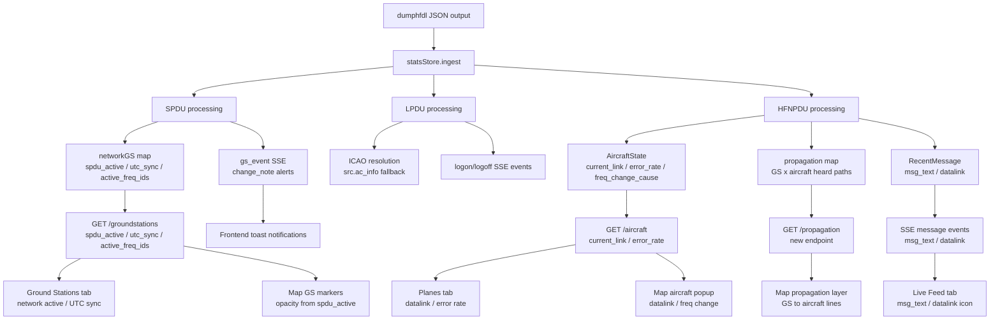

# Missing dumphfdl JSON Fields — Analysis & Implementation Plan

This document catalogues every field that dumphfdl emits in its `decoded:json` output that
ubersdr_hfdl currently ignores, explains what each field means, and proposes concrete backend
(Go) and frontend (JS/HTML) changes to make use of it.

---

## 1. Background

ubersdr_hfdl reads dumphfdl's JSON output line-by-line in
[`cmd/hfdl_launcher/instance.go`](../cmd/hfdl_launcher/instance.go) and passes each line to
[`statsStore.ingest()`](../cmd/hfdl_launcher/stats.go) for parsing.  The Go struct
[`hfdlMessage`](../cmd/hfdl_launcher/stats.go) that drives the parse is a deliberately minimal
subset of the full schema.  The frontend consumes the processed data through a set of REST
endpoints and a Server-Sent Events stream.

The full dumphfdl JSON schema is defined across four C source files:

| Source file | What it serialises |
|---|---|
| [`fmtr-json.c`](../../dumphfdl/src/fmtr-json.c) | Top-level envelope (`hfdl.*`) |
| [`spdu.c`](../../dumphfdl/src/spdu.c) | Squitter PDU (`hfdl.spdu.*`) |
| [`lpdu.c`](../../dumphfdl/src/lpdu.c) | Link PDU (`hfdl.lpdu.*`) |
| [`hfnpdu.c`](../../dumphfdl/src/hfnpdu.c) | Network PDU (`hfdl.lpdu.hfnpdu.*`) |

---

## 2. Message-by-message gap analysis

### 2.1 Top-level envelope fields

These appear in **every** message regardless of type.

| JSON path | Type | Currently parsed | Meaning |
|---|---|---|---|
| `hfdl.app.name` | string | ❌ | Always `"dumphfdl"` — useful for multi-source setups |
| `hfdl.app.ver` | string | ❌ | dumphfdl version string, e.g. `"1.7.0"` |
| `hfdl.station` | string | ❌ | Station ID set via `--station-id` CLI flag; absent if not configured |
| `hfdl.t.sec` | int64 | ✅ | Unix timestamp seconds |
| `hfdl.t.usec` | int64 | ✅ | Microsecond part of timestamp |
| `hfdl.freq` | int64 | ✅ | Centre frequency in Hz |
| `hfdl.bit_rate` | int | ✅ | Modulation bit rate (300/600/1200/1800 bps) |
| `hfdl.sig_level` | float | ✅ | Signal level in dBFS |
| `hfdl.noise_level` | float | ✅ | Noise floor in dBFS |
| `hfdl.freq_skew` | float | ✅ | Frequency error in Hz |
| `hfdl.slot` | string | ✅ | TDMA slot identifier |

**What we are missing:**

- `hfdl.app.ver` — useful to surface in the Instances tab so operators know which dumphfdl
  version is running without SSHing into the container.
- `hfdl.station` — if multiple ubersdr_hfdl instances feed a shared display, the station ID
  disambiguates the source.  Currently there is no way to know which receiver heard a message.

**Backend change:** Add `App` and `Station` fields to `hfdlMessage`.  Store the version string
in `statsStore` and expose it via `/stats`.

**Frontend change:** Show dumphfdl version in the Instances tab next to each window.

---

### 2.2 SPDU — Squitter PDU (ground station beacon)

SPDUs are broadcast by every active ground station every ~32 seconds.  They are the heartbeat
of the HFDL network and carry the most operationally useful topology information.

#### 2.2.1 Fields currently parsed

| JSON path | Parsed |
|---|---|
| `hfdl.spdu.src.type` | ✅ |
| `hfdl.spdu.src.id` | ✅ |

#### 2.2.2 Fields currently ignored

| JSON path | Type | Meaning |
|---|---|---|
| `hfdl.spdu.err` | bool | CRC check failed — frame is corrupt |
| `hfdl.spdu.spdu_version` | int | SPDU protocol version (0–3) |
| `hfdl.spdu.rls` | bool | RLS (Reliable Link Service) in use |
| `hfdl.spdu.iso` | bool | ISO 8208 supported |
| `hfdl.spdu.change_note` | string | `"None"` / `"Channel down"` / `"Upcoming frequency change"` / `"Ground station down"` |
| `hfdl.spdu.frame_index` | int | TDMA frame counter (monotonically increasing) |
| `hfdl.spdu.frame_offset` | int | Slot offset within the frame |
| `hfdl.spdu.min_priority` | int | Minimum message priority accepted by this GS |
| `hfdl.spdu.systable_version` | int | System table version the GS is broadcasting |
| `hfdl.spdu.gs_status[]` | array | **Array of 3 GS status objects** (see below) |

#### 2.2.3 `gs_status` array — the most important missing data

Each SPDU carries status for exactly **3 ground stations** (the transmitting GS plus two
neighbours).  Each element has:

| JSON path | Type | Meaning |
|---|---|---|
| `gs_status[n].gs.type` | string | Always `"Ground station"` |
| `gs_status[n].gs.id` | int | Ground station ID (1–17) |
| `gs_status[n].utc_sync` | bool | Whether this GS has UTC synchronisation |
| `gs_status[n].freqs[]` | array | Active frequency slot IDs for this GS, e.g. `[{"id":1},{"id":2}]` |

**Why this matters:**  This is the only way to know which ground stations are currently
**active** and on which frequency slots, without waiting for an aircraft to communicate with
them.  Currently the Ground Stations tab only marks a GS as "heard" when ubersdr_hfdl receives
a message *from* it as a source.  With `gs_status` we can show the full live network topology
in real time.

**Example from `example.json`:**
```json
"gs_status": [
  {"gs": {"type": "Ground station", "id": 3}, "utc_sync": true, "freqs": [{"id": 2}, {"id": 5}]},
  {"gs": {"type": "Ground station", "id": 4}, "utc_sync": true, "freqs": [{"id": 4}, {"id": 5}]},
  {"gs": {"type": "Ground station", "id": 5}, "utc_sync": true, "freqs": [{"id": 1}, {"id": 2}]}
]
```

**Backend changes:**
1. Extend `hfdlMessage.HFDL.SPDU` to include `SPDUVersion`, `RLS`, `ISO`, `ChangeNote`,
   `FrameIndex`, `FrameOffset`, `MinPriority`, `SystableVersion`, and `GSStatus []GSStatusEntry`.
2. Add `GSStatusEntry` struct: `GS struct{ Type string; ID int }`, `UTCSync bool`,
   `Freqs []struct{ ID int }`.
3. In `ingest()`, when processing an SPDU, iterate `gs_status` and update a new
   `networkGS map[int]*NetworkGSState` in `statsStore`.  `NetworkGSState` should track:
   - `LastSeen int64` — unix seconds of last SPDU mentioning this GS
   - `UTCSync bool`
   - `ActiveFreqIDs []int` — slot IDs currently active
   - `SystableVersion int`
4. Add `ChangeNote` events: when `change_note != "None"`, emit a new SSE event type
   `"gs_event"` with `{ gs_id, change_note, time }` so the frontend can show alerts.
5. Expose `networkGS` via a new `/network/groundstations` endpoint (or merge into
   `/groundstations`).

**Frontend changes:**
1. Ground Stations tab: add a "Network status" column showing UTC sync state and active
   frequency slots derived from SPDU data (distinct from "heard" which requires a message).
2. Map: update GS marker opacity/colour based on SPDU-reported active state, not just
   whether we have received a message from them.
3. Add a toast/notification system for `gs_event` SSE events — show a banner when a GS
   reports `"Ground station down"` or `"Channel down"`.

---

### 2.3 LPDU — Link PDU

LPDUs wrap all aircraft↔GS communication.

#### 2.3.1 Fields currently parsed

| JSON path | Parsed |
|---|---|
| `hfdl.lpdu.src.type` | ✅ |
| `hfdl.lpdu.src.id` | ✅ |
| `hfdl.lpdu.dst.type` | ✅ |
| `hfdl.lpdu.dst.id` | ✅ |
| `hfdl.lpdu.type.name` | ✅ |
| `hfdl.lpdu.ac_info.icao` | ✅ (top-level only) |

#### 2.3.2 Fields currently ignored

| JSON path | Type | Meaning |
|---|---|---|
| `hfdl.lpdu.err` | bool | Parse/CRC error |
| `hfdl.lpdu.type.id` | int | Numeric LPDU type (0x0D, 0x1D, 0x9F, etc.) |
| `hfdl.lpdu.src.ac_info.icao` | string | **ICAO embedded inside `src` object** when source is an aircraft whose ICAO is known from the AC cache — currently missed entirely |
| `hfdl.lpdu.assigned_ac_id` | int | Assigned aircraft slot ID on `Logon confirm` / `Logon resume confirm` |
| `hfdl.lpdu.reason.code` | int | Reason code on `Logon denied` / `Logoff request` |
| `hfdl.lpdu.reason.descr` | string | Human-readable reason description |

**The `src.ac_info` bug:**  When an aircraft is already logged on and its ICAO is in
dumphfdl's AC cache, the ICAO appears inside `lpdu.src` rather than at `lpdu.ac_info`.
The current Go struct only has `AcInfo *struct{ ICAO string }` at the LPDU level, so these
messages never get an ICAO assigned.  This means aircraft that are actively communicating
(not just logging on) may never get their ICAO populated.

**Backend changes:**
1. Add `Err bool` to the LPDU struct.
2. Add `ac_info` inside the `Src` struct as well as at the top level.
3. In `ingest()`, check both `lpdu.src.ac_info.icao` and `lpdu.ac_info.icao` when resolving
   the aircraft ICAO.
4. Add `AssignedAcID int` and `Reason *struct{ Code int; Descr string }` to the LPDU struct.
5. Track logon/logoff events: emit a new SSE event type `"logon"` / `"logoff"` with
   `{ icao, gs_id, freq_khz, time, reason }` for the Live Feed and a future Events tab.

**Frontend changes:**
1. Live Feed: add a "Logon/Logoff" indicator column or colour-code rows by LPDU type.
2. Aircraft popup: show ICAO for more aircraft (fixes the `src.ac_info` bug).

---

### 2.4 HFNPDU — Performance Data (type 0xD1, id 209)

Performance Data PDUs are sent by aircraft periodically and contain rich telemetry about the
HFDL link quality.  They always include a position fix.

#### 2.4.1 Fields currently parsed

| JSON path | Parsed |
|---|---|
| `hfdl.lpdu.hfnpdu.type.id` | ✅ (used to distinguish type) |
| `hfdl.lpdu.hfnpdu.flight_id` | ✅ |
| `hfdl.lpdu.hfnpdu.pos.lat` | ✅ |
| `hfdl.lpdu.hfnpdu.pos.lon` | ✅ |

#### 2.4.2 Fields currently ignored

| JSON path | Type | Meaning |
|---|---|---|
| `hfdl.lpdu.hfnpdu.err` | bool | Parse error |
| `hfdl.lpdu.hfnpdu.type.name` | string | `"Performance data"` |
| `hfdl.lpdu.hfnpdu.version` | int | Performance data format version (2, 12, 18 seen in practice) |
| `hfdl.lpdu.hfnpdu.time.hour` | int | Aircraft-reported UTC hour |
| `hfdl.lpdu.hfnpdu.time.min` | int | Aircraft-reported UTC minute |
| `hfdl.lpdu.hfnpdu.time.sec` | int | Aircraft-reported UTC second |
| `hfdl.lpdu.hfnpdu.flight_leg_num` | int | Flight leg counter (increments each time the aircraft changes GS) |
| `hfdl.lpdu.hfnpdu.gs.type` | string | GS type the aircraft is registered with |
| `hfdl.lpdu.hfnpdu.gs.id` | int | GS ID the aircraft is currently registered with |
| `hfdl.lpdu.hfnpdu.frequency.id` | int | Frequency slot bitmask the aircraft is using |
| `hfdl.lpdu.hfnpdu.frequency.freq` | float | Actual frequency in kHz (only present if system table is known) |
| `hfdl.lpdu.hfnpdu.freq_search_cnt.cur_leg` | int | Number of frequency searches this flight leg |
| `hfdl.lpdu.hfnpdu.freq_search_cnt.prev_leg` | int | Number of frequency searches previous leg |
| `hfdl.lpdu.hfnpdu.hfdl_disabled_duration.this_leg` | int | Seconds HFDL was disabled this leg |
| `hfdl.lpdu.hfnpdu.hfdl_disabled_duration.prev_leg` | int | Seconds HFDL was disabled previous leg |
| `hfdl.lpdu.hfnpdu.pdu_stats.mpdus_rx_ok_cnt` | object | MPDUs received OK at 300/600/1200/1800 bps |
| `hfdl.lpdu.hfnpdu.pdu_stats.mpdus_rx_err_cnt` | object | MPDUs received with errors |
| `hfdl.lpdu.hfnpdu.pdu_stats.mpdus_tx_cnt` | object | MPDUs transmitted |
| `hfdl.lpdu.hfnpdu.pdu_stats.mpdus_delivered_cnt` | object | MPDUs successfully delivered |
| `hfdl.lpdu.hfnpdu.pdu_stats.spdus_rx_ok_cnt` | int | SPDUs received OK |
| `hfdl.lpdu.hfnpdu.pdu_stats.spdus_missed_cnt` | int | SPDUs missed |
| `hfdl.lpdu.hfnpdu.last_freq_change_cause.code` | int | Numeric reason for last frequency change |
| `hfdl.lpdu.hfnpdu.last_freq_change_cause.descr` | string | `"No change"` / `"Too many NACKs"` / `"SPDUs no longer received"` / `"HFDL disabled"` / `"GS frequency change"` / `"GS down / channel down"` / `"Poor uplink channel quality"` |

**Why this matters:**  The `pdu_stats` block is a direct report from the aircraft on link
quality — error rates, delivery rates, and missed SPDUs.  The `last_freq_change_cause` tells
you *why* an aircraft switched frequencies.  Together these are the richest link-quality
telemetry available in HFDL.

**Backend changes:**
1. Add `PerformanceData` struct to `hfdlMessage` with all the above fields.
2. Store per-aircraft performance data in `AircraftState`: add `LastFreqChangeCause string`,
   `PDUStats *PDUStats`, `FreqSearchCnt int`, `HFDLDisabledDuration int`.
3. Expose these in the `/aircraft` endpoint response.

**Frontend changes:**
1. Planes tab: add a "Link quality" column showing error rate (rx_err / rx_ok as a
   percentage) and last frequency change cause.
2. Aircraft popup on map: show `last_freq_change_cause.descr` and MPDU error rate.
3. New "Aircraft Detail" panel (slide-in or modal): show full `pdu_stats` breakdown as a
   mini bar chart (300/600/1200/1800 bps RX/TX/error counts).

---

### 2.5 HFNPDU — Frequency Data (type 0xD5, id 213)

Frequency Data PDUs are sent during logon/resume and contain the aircraft's view of the HFDL
network — which ground stations it can hear and on which frequencies.  They always include a
position fix.

#### 2.5.1 Fields currently parsed

| JSON path | Parsed |
|---|---|
| `hfdl.lpdu.hfnpdu.flight_id` | ✅ |
| `hfdl.lpdu.hfnpdu.pos.lat` | ✅ |
| `hfdl.lpdu.hfnpdu.pos.lon` | ✅ |

#### 2.5.2 Fields currently ignored

| JSON path | Type | Meaning |
|---|---|---|
| `hfdl.lpdu.hfnpdu.utc_time.hour/min/sec` | int | Aircraft-reported UTC time (**note:** key is `utc_time` not `time` for this type) |
| `hfdl.lpdu.hfnpdu.freq_data[]` | array | Up to 6 objects, one per GS the aircraft knows about |
| `freq_data[n].gs.id` | int | Ground station ID |
| `freq_data[n].listening_on_freqs[]` | array | Frequency slot IDs the aircraft is monitoring for this GS |
| `freq_data[n].heard_on_freqs[]` | array | Frequency slot IDs the aircraft has actually received from this GS |

**Why this matters:**  `freq_data` is the aircraft's propagation report.  An empty
`heard_on_freqs` for a GS means the aircraft cannot hear that station at all.  A non-empty
`heard_on_freqs` means propagation is good.  Aggregating this across many aircraft gives a
real-time HF propagation map — which GS↔aircraft paths are open right now.

**Backend changes:**
1. Add `FreqData []PropFreqEntry` to the HFNPDU struct.
2. Add `PropFreqEntry` struct: `GSID int`, `ListeningOnFreqs []int`, `HeardOnFreqs []int`.
3. In `ingest()`, for each `freq_data` entry, update a new `propagation` map in `statsStore`:
   `map[int]map[int]*PropagationStats` (outer key = GS ID, inner key = aircraft key).
   `PropagationStats`: `HeardFreqIDs []int`, `ListeningFreqIDs []int`, `LastSeen int64`.
4. Expose via a new `/propagation` endpoint returning the current propagation matrix.

**Frontend changes:**
1. Ground Stations tab: add a "Heard by N aircraft" column showing how many aircraft
   currently report hearing each GS.
2. Map: draw faint lines from GS markers to aircraft that report hearing them (toggle layer).
3. New "Propagation" tab or map overlay: show a matrix of GS↔aircraft propagation paths
   colour-coded by number of heard frequencies.

---

### 2.6 HFNPDU — Enveloped Data (type 0xFF, id 255) → ACARS

Enveloped Data wraps ACARS messages decoded by libacars.  This is the most common HFNPDU type.

#### 2.6.1 Fields currently parsed

| JSON path | Parsed |
|---|---|
| `hfdl.lpdu.hfnpdu.acars.reg` | ✅ (leading `.` stripped) |
| `hfdl.lpdu.hfnpdu.acars.flight` | ✅ (leading `.` stripped) |
| `hfdl.lpdu.hfnpdu.acars.label` | ✅ |

#### 2.6.2 Fields currently ignored

| JSON path | Type | Meaning |
|---|---|---|
| `hfdl.lpdu.hfnpdu.acars.err` | bool | ACARS parse error |
| `hfdl.lpdu.hfnpdu.acars.crc_ok` | bool | ACARS CRC check result |
| `hfdl.lpdu.hfnpdu.acars.more` | bool | Reassembly fragment — more fragments to follow |
| `hfdl.lpdu.hfnpdu.acars.mode` | string | ACARS mode character (e.g. `"2"`) |
| `hfdl.lpdu.hfnpdu.acars.blk_id` | string | Block ID character |
| `hfdl.lpdu.hfnpdu.acars.ack` | string | Acknowledgement character |
| `hfdl.lpdu.hfnpdu.acars.msg_text` | string | **The actual ACARS message body** |
| `hfdl.lpdu.hfnpdu.acars.msg_num` | string | Message sequence number |
| `hfdl.lpdu.hfnpdu.acars.msg_num_seq` | string | Message sequence sub-number |
| `hfdl.lpdu.hfnpdu.acars.sublabel` | string | ACARS sublabel (e.g. `"DF"`, `"MD"`) |
| `hfdl.lpdu.hfnpdu.acars.media-adv` | object | Media Advisory — current and available datalinks |
| `hfdl.lpdu.hfnpdu.acars.arinc622` | object | ARINC 622 ADS-C contract data |

#### 2.6.3 `media-adv` object

| JSON path | Type | Meaning |
|---|---|---|
| `media-adv.err` | bool | Parse error |
| `media-adv.version` | int | Media Advisory version |
| `media-adv.current_link.code` | string | Current datalink code (`"H"` = HF, `"V"` = VHF, `"S"` = SATCOM) |
| `media-adv.current_link.descr` | string | Human-readable description |
| `media-adv.current_link.established` | bool | Whether the link is established |
| `media-adv.current_link.time.hour/min/sec` | int | Time the current link was established |
| `media-adv.links_avail[]` | array | All datalinks available to this aircraft |
| `media-adv.links_avail[n].code` | string | Link code |
| `media-adv.links_avail[n].descr` | string | Link description |

**Why this matters:**  Media Advisory messages tell you whether an aircraft is currently on
HF, VHF ACARS, or SATCOM, and what other links it has available.  This is useful for
understanding why an aircraft is using HFDL (e.g. out of VHF range, SATCOM unavailable).

#### 2.6.4 `arinc622.adsc` object

The ARINC 622 / ADS-C block is decoded by libacars and can contain:
- Periodic position contracts with lat/lon/altitude/speed/heading
- Predicted route waypoints
- Meteorological data

This is the richest position data available in HFDL — more precise than the HFNPDU position
fields and potentially including altitude and speed.

**Backend changes:**
1. Add `MsgText string`, `Label string`, `Sublabel string`, `MsgNum string`, `More bool`,
   `CRCOk bool` to the ACARS struct in `hfdlMessage`.
2. Add `MediaAdv *MediaAdvisory` struct with `CurrentLink LinkInfo` and `LinksAvail []LinkInfo`.
3. Store `MsgText` in `RecentMessage` so the Live Feed can show message content.
4. Store `MediaAdv` in `AircraftState` as `CurrentLink string` (the code: H/V/S).
5. For `arinc622.adsc`, add a minimal struct to capture position contracts if present
   (lat/lon/alt from ADS-C periodic reports).

**Frontend changes:**
1. Live Feed: add a "Message" column showing truncated `msg_text` (first 60 chars, expandable).
2. Live Feed: add a datalink indicator icon (📡 HF / 📶 VHF / 🛰 SATCOM) based on
   `media-adv.current_link.code`.
3. Planes tab: add a "Datalink" column showing current link type.
4. Aircraft popup: show current datalink and available links.

---

### 2.7 HFNPDU — System Table (type 0xD0, id 208)

System Table PDUs carry the HFDL frequency plan — which frequencies each GS uses and their
slot assignments.  They are split across multiple PDUs and reassembled by dumphfdl.

#### 2.7.1 Fields currently ignored

| JSON path | Type | Meaning |
|---|---|---|
| `hfdl.lpdu.hfnpdu.version` | int | System table version number |
| `hfdl.lpdu.hfnpdu.systable_partial.part_num` | int | Which part of the multi-PDU set this is |
| `hfdl.lpdu.hfnpdu.systable_partial.parts_cnt` | int | Total number of parts in the set |

**Note:** The fully reassembled system table is decoded by dumphfdl internally and used to
resolve frequency IDs to actual kHz values.  The partial PDU JSON only shows the version and
fragment info.  The complete decoded table is not emitted as JSON — it is used internally.

**Backend changes:**  Track `systable_version` in `statsStore` and expose it via `/stats`.
This lets operators know if the system table is current.

**Frontend changes:**  Show system table version in the Instances or Ground Stations tab.

---

### 2.8 HFNPDU — System Table Request (type 0xD2, id 210)

Sent by aircraft to request the system table from a GS.

#### 2.8.1 Fields currently ignored

| JSON path | Type | Meaning |
|---|---|---|
| `hfdl.lpdu.hfnpdu.request_data` | int | Bitmask of requested table sections |

**Backend/Frontend changes:**  Low priority.  Could be counted in the Live Feed as a
`"System table request"` message type, which is already shown via `lpdu.type.name`.

---

### 2.9 HFNPDU — Delayed Echo (type 0xDE, id 222)

A loopback test PDU.  dumphfdl emits only `type.id` and `type.name` for this type — no
additional fields.  Currently handled correctly (type name is captured).

---

## 3. Priority ranking

| Priority | Feature | Impact | Effort |
|---|---|---|---|
| 🔴 High | `spdu.gs_status[]` — live network topology | Shows which GS are active without waiting for aircraft messages | Medium |
| 🔴 High | `spdu.change_note` — GS down/channel down alerts | Operational awareness | Low |
| 🔴 High | `lpdu.src.ac_info.icao` bug fix | More aircraft get ICAO populated | Low |
| 🟡 Medium | `acars.msg_text` in Live Feed | Shows actual message content | Low |
| 🟡 Medium | `media-adv.current_link` — datalink type | Shows HF/VHF/SATCOM per aircraft | Low |
| 🟡 Medium | `hfnpdu.last_freq_change_cause` | Link quality insight | Low |
| 🟡 Medium | `hfnpdu.pdu_stats` — MPDU error rates | Link quality telemetry | Medium |
| 🟢 Low | `freq_data[]` — propagation matrix | HF propagation map | High |
| 🟢 Low | `hfdl.app.ver` / `hfdl.station` | Version/station display | Low |
| 🟢 Low | `lpdu.assigned_ac_id` / `lpdu.reason` | Logon lifecycle tracking | Low |
| 🟢 Low | `systable_version` | System table currency | Low |

---

## 4. Proposed implementation plan

### Phase 1 — Bug fixes and quick wins (backend + frontend)

1. **Fix `lpdu.src.ac_info.icao` bug** in [`stats.go`](../cmd/hfdl_launcher/stats.go):
   - Add `AcInfo *struct{ ICAO string }` inside the `Src` struct of `hfdlMessage.HFDL.LPDU`.
   - In `ingest()`, check `h.LPDU.Src.AcInfo` as a fallback when `h.LPDU.AcInfo` is nil.

2. **Add `acars.msg_text`** to `hfdlMessage` and `RecentMessage`:
   - Add `MsgText string` to the ACARS struct.
   - Add `MsgText string` to `RecentMessage`.
   - In the Live Feed frontend, add a truncated message column.

3. **Add `spdu.change_note`** to `hfdlMessage.HFDL.SPDU`:
   - Emit a new SSE event type `"gs_event"` when `change_note != "None"`.
   - Frontend: show a dismissible toast notification.

4. **Add `hfdl.app.ver`** to `hfdlMessage` and store in `statsStore`:
   - Expose via `/stats` as `dumphfdl_version`.
   - Show in Instances tab.

### Phase 2 — SPDU network topology

5. **Parse `spdu.gs_status[]`** fully:
   - Add `GSStatus []GSStatusEntry` to the SPDU struct.
   - Add `networkGS map[int]*NetworkGSState` to `statsStore`.
   - Update `NetworkGSState` on every SPDU.
   - Merge into `/groundstations` response: add `spdu_active bool`, `spdu_last_seen int64`,
     `utc_sync bool`, and `active_freq_ids []int` fields.
   - Frontend Ground Stations tab: add "SPDU Active" badge and UTC sync indicator.
   - Frontend Map: change GS marker opacity based on SPDU-reported active state (not just
     whether we have received a message from them as source).

### Phase 3 — Aircraft link quality and ACARS content

6. **Parse `hfnpdu.last_freq_change_cause`**:
   - Add `LastFreqChangeCause *struct{ Code int; Descr string }` to the HFNPDU struct.
   - Store `LastFreqChangeCause string` in `AircraftState`.
   - Show in aircraft popup and Planes tab.

7. **Parse `hfnpdu.pdu_stats`**:
   - Add `PDUStats *PDUStats` struct to the HFNPDU struct with all MPDU/SPDU counters.
   - Store in `AircraftState` as `LastPDUStats *PDUStats`.
   - Compute `ErrorRate float64` = `mpdus_rx_err_cnt.total / (mpdus_rx_ok_cnt.total + mpdus_rx_err_cnt.total)`.
   - Show error rate in Planes tab and aircraft popup.

8. **Parse `media-adv.current_link`**:
   - Add `MediaAdv *struct{ CurrentLink struct{ Code string; Descr string } }` to the ACARS struct.
   - Store `CurrentLink string` in `AircraftState`.
   - Show datalink icon (HF/VHF/SATCOM) in Planes tab and aircraft popup.
   - Add to `RecentMessage` for the Live Feed datalink column.

9. **Parse `hfnpdu.time` / `hfnpdu.utc_time`**:
   - Add `Time *struct{ Hour int; Min int; Sec int }` and `UTCTime *struct{ Hour int; Min int; Sec int }`
     to the HFNPDU struct (Performance Data uses `time`, Frequency Data uses `utc_time`).
   - Store aircraft-reported time in `AircraftState` as `AircraftTime string` (formatted HH:MM:SS UTC).
   - Show in aircraft popup alongside `last_seen`.

### Phase 4 — Propagation data

10. **Parse `hfnpdu.freq_data[]`**:
    - Add `FreqData []PropFreqEntry` to the HFNPDU struct.
    - Add `propagation map[int]map[string]*PropEntry` to `statsStore`
      (outer key = GS ID, inner key = aircraft key).
    - Expose via new `/propagation` endpoint.
    - Frontend: new "Propagation" map layer showing GS↔aircraft heard paths as faint lines.
    - Frontend Ground Stations tab: "Heard by N aircraft" column.

---

## 5. Go struct changes summary

The following additions to [`hfdlMessage`](../cmd/hfdl_launcher/stats.go) in `stats.go` cover
all phases above:

```go
type hfdlMessage struct {
    HFDL struct {
        App struct {
            Name string `json:"name"`
            Ver  string `json:"ver"`
        } `json:"app"`
        Station string `json:"station,omitempty"`

        T struct {
            Sec  int64 `json:"sec"`
            Usec int64 `json:"usec"`
        } `json:"t"`
        Freq       int64   `json:"freq"`
        BitRate    int     `json:"bit_rate"`
        SigLevel   float64 `json:"sig_level"`
        NoiseLevel float64 `json:"noise_level"`
        FreqSkew   float64 `json:"freq_skew"`
        Slot       string  `json:"slot"`

        LPDU *struct {
            Err bool `json:"err"`
            Src struct {
                Type   string `json:"type"`
                ID     int    `json:"id"`
                AcInfo *struct {   // ← NEW: ICAO embedded in src when AC is in cache
                    ICAO string `json:"icao"`
                } `json:"ac_info"`
            } `json:"src"`
            Dst struct {
                Type string `json:"type"`
                ID   int    `json:"id"`
            } `json:"dst"`
            Type struct {
                ID   int    `json:"id"`
                Name string `json:"name"`
            } `json:"type"`
            AcInfo *struct {
                ICAO string `json:"icao"`
            } `json:"ac_info"`
            AssignedAcID int `json:"assigned_ac_id,omitempty"` // ← NEW
            Reason *struct {                                     // ← NEW
                Code  int    `json:"code"`
                Descr string `json:"descr"`
            } `json:"reason"`
            HFNPDU *struct {
                Err  bool `json:"err"`
                Type struct {
                    ID   int    `json:"id"`
                    Name string `json:"name"`
                } `json:"type"`
                FlightID string `json:"flight_id"`
                Pos *struct {
                    Lat float64 `json:"lat"`
                    Lon float64 `json:"lon"`
                } `json:"pos"`
                // Performance Data (type 209) uses "time"
                Time *struct {
                    Hour int `json:"hour"`
                    Min  int `json:"min"`
                    Sec  int `json:"sec"`
                } `json:"time"`
                // Frequency Data (type 213) uses "utc_time"
                UTCTime *struct {
                    Hour int `json:"hour"`
                    Min  int `json:"min"`
                    Sec  int `json:"sec"`
                } `json:"utc_time"`
                // Performance Data fields (type 209)
                Version       int `json:"version"`
                FlightLegNum  int `json:"flight_leg_num"`
                GS *struct {
                    Type string `json:"type"`
                    ID   int    `json:"id"`
                } `json:"gs"`
                Frequency *struct {
                    ID   int     `json:"id"`
                    Freq float64 `json:"freq"`
                } `json:"frequency"`
                FreqSearchCnt *struct {
                    CurLeg  int `json:"cur_leg"`
                    PrevLeg int `json:"prev_leg"`
                } `json:"freq_search_cnt"`
                HFDLDisabledDuration *struct {
                    ThisLeg int `json:"this_leg"`
                    PrevLeg int `json:"prev_leg"`
                } `json:"hfdl_disabled_duration"`
                PDUStats *struct {
                    MPDUsRxOK        mpduStatsCounts `json:"mpdus_rx_ok_cnt"`
                    MPDUsRxErr       mpduStatsCounts `json:"mpdus_rx_err_cnt"`
                    MPDUsTx          mpduStatsCounts `json:"mpdus_tx_cnt"`
                    MPDUsDelivered   mpduStatsCounts `json:"mpdus_delivered_cnt"`
                    SPDUsRxOK        int             `json:"spdus_rx_ok_cnt"`
                    SPDUsMissed      int             `json:"spdus_missed_cnt"`
                } `json:"pdu_stats"`
                LastFreqChangeCause *struct {
                    Code  int    `json:"code"`
                    Descr string `json:"descr"`
                } `json:"last_freq_change_cause"`
                // Frequency Data fields (type 213)
                FreqData []struct {
                    GS struct {
                        Type string `json:"type"`
                        ID   int    `json:"id"`
                    } `json:"gs"`
                    ListeningOnFreqs []struct{ ID int `json:"id"` } `json:"listening_on_freqs"`
                    HeardOnFreqs     []struct{ ID int `json:"id"` } `json:"heard_on_freqs"`
                } `json:"freq_data"`
                // Enveloped Data (type 255) → ACARS
                ACARS *struct {
                    Err    bool   `json:"err"`
                    CRCOk  bool   `json:"crc_ok"`
                    More   bool   `json:"more"`
                    Reg    string `json:"reg"`
                    Flight string `json:"flight"`
                    Label  string `json:"label"`
                    Sublabel string `json:"sublabel"`
                    MsgNum    string `json:"msg_num"`
                    MsgText   string `json:"msg_text"`
                    MediaAdv *struct {
                        CurrentLink struct {
                            Code        string `json:"code"`
                            Descr       string `json:"descr"`
                            Established bool   `json:"established"`
                        } `json:"current_link"`
                        LinksAvail []struct {
                            Code  string `json:"code"`
                            Descr string `json:"descr"`
                        } `json:"links_avail"`
                    } `json:"media-adv"`
                } `json:"acars"`
            } `json:"hfnpdu"`
        } `json:"lpdu"`

        SPDU *struct {
            Err            bool   `json:"err"`
            Src struct {
                Type string `json:"type"`
                ID   int    `json:"id"`
            } `json:"src"`
            SPDUVersion    int    `json:"spdu_version"`
            RLS            bool   `json:"rls"`
            ISO            bool   `json:"iso"`
            ChangeNote     string `json:"change_note"`
            FrameIndex     int    `json:"frame_index"`
            FrameOffset    int    `json:"frame_offset"`
            MinPriority    int    `json:"min_priority"`
            SystableVersion int   `json:"systable_version"`
            GSStatus []struct {
                GS struct {
                    Type string `json:"type"`
                    ID   int    `json:"id"`
                } `json:"gs"`
                UTCSync bool `json:"utc_sync"`
                Freqs []struct {
                    ID int `json:"id"`
                } `json:"freqs"`
            } `json:"gs_status"`
        } `json:"spdu"`
    } `json:"hfdl"`
}

type mpduStatsCounts struct {
    Bps300  int `json:"300bps"`
    Bps600  int `json:"600bps"`
    Bps1200 int `json:"1200bps"`
    Bps1800 int `json:"1800bps"`
}
```

---

## 6. New and updated API endpoints

| Endpoint | Change | Purpose |
|---|---|---|
| `GET /stats` | Add `dumphfdl_version string`, `station string`, `systable_version int` | Version/station info |
| `GET /aircraft` | Add `current_link string`, `last_freq_change_cause string`, `error_rate float64`, `aircraft_time string` | Richer aircraft state |
| `GET /groundstations` | Add `spdu_active bool`, `spdu_last_seen int64`, `utc_sync bool`, `active_freq_ids []int` | SPDU-derived GS state |
| `GET /propagation` | **New endpoint** | Returns `[{gs_id, aircraft_key, heard_freq_ids, listening_freq_ids, last_seen}]` |
| SSE `/events` | Add event types `"gs_event"` and `"logon"` / `"logoff"` | GS alerts and logon lifecycle |

---

## 7. New and updated frontend components

### 7.1 Live Feed tab (`static/app.js`)

| Change | Field source |
|---|---|
| Add "Message" column (truncated `msg_text`, expandable on click) | `acars.msg_text` |
| Add datalink icon column (📡 HF / 📶 VHF / 🛰 SATCOM) | `media-adv.current_link.code` |
| Colour-code rows by LPDU type (logon = green, logoff = red, data = default) | `lpdu.type.name` |

### 7.2 Planes tab (`static/app.js`)

| Change | Field source |
|---|---|
| Add "Datalink" column | `AircraftState.current_link` |
| Add "Link quality" column (error rate %) | `AircraftState.error_rate` |
| Add "Freq change" column | `AircraftState.last_freq_change_cause` |

### 7.3 Ground Stations tab (`static/app.js`)

| Change | Field source |
|---|---|
| Add "Network active" badge (from SPDU, not just heard) | `groundStationResponse.spdu_active` |
| Add UTC sync indicator | `groundStationResponse.utc_sync` |
| Add "Active slots" column | `groundStationResponse.active_freq_ids` |
| Add "Heard by N aircraft" column | `/propagation` endpoint |

### 7.4 Map (`static/map.js`)

| Change | Field source |
|---|---|
| GS marker opacity: full if SPDU-active, dim if only heard, very dim if neither | `spdu_active` + `last_heard` |
| Aircraft popup: add datalink, link quality, freq change cause | `AircraftState` new fields |
| GS popup: add UTC sync, active slots, heard-by count | `groundStationResponse` new fields |
| New "Propagation" layer toggle: faint lines from GS to aircraft that hear them | `/propagation` endpoint |

### 7.5 Toast notification system (new, `static/app.js`)

- Subscribe to `"gs_event"` SSE events.
- Show a dismissible banner at the top of the page: e.g.
  `"⚠ GS 7 (Shannon): Ground station down"` with a timestamp.
- Auto-dismiss after 30 seconds; keep a log of the last 10 events accessible via a bell icon.

---

## 8. Data flow diagram



---

## 9. Files to be modified

| File | Changes |
|---|---|
| [`cmd/hfdl_launcher/stats.go`](../cmd/hfdl_launcher/stats.go) | Expand `hfdlMessage` struct; update `ingest()`; add `networkGS`, `propagation` maps to `statsStore`; add new snapshot methods |
| [`cmd/hfdl_launcher/web.go`](../cmd/hfdl_launcher/web.go) | Add `/propagation` endpoint; update `/groundstations` and `/aircraft` responses; add `"gs_event"` and `"logon"`/`"logoff"` SSE event types |
| [`static/app.js`](../static/app.js) | Update Live Feed, Planes, Ground Stations tabs; add toast notification system; handle new SSE event types |
| [`static/map.js`](../static/map.js) | Update GS marker opacity logic; update aircraft/GS popups; add propagation layer toggle |
| [`static/index.html`](../static/index.html) | Add toast container div; add propagation layer checkbox to map layer control |
| [`static/style.css`](../static/style.css) | Add toast styles; add propagation line styles; add datalink icon styles |

---

## 10. Proposed new frontend tabs

The current tab bar has: **Map · Frequencies · Live Feed · Ground Stations · Planes · Instances · Signal**.

The following new tabs are proposed, ordered by implementation priority.

---

### 10.1 Events tab

**Purpose**: A persistent, scrollable log of significant network events — logons, logoffs, GS state changes, and frequency reassignments.

**What it shows**:

| Column | Source |
|---|---|
| Time | `hfdl.t` |
| Event type | `lpdu.type.name` / `spdu.change_note` |
| Aircraft (ICAO / reg) | `lpdu.src.ac_info.icao` |
| Ground station | `lpdu.dst.id` or `spdu.src.id` |
| Detail | e.g. logoff reason, new freq, GS down note |

**Why it is interesting**: The map and Live Feed only show the current moment. The Events tab gives operators a timeline of what happened — which aircraft logged on/off, when a GS went down, when a frequency was reassigned. This is the primary diagnostic view for understanding network health over time.

**Implementation notes**:
- Backend: emit `"logon"`, `"logoff"`, `"gs_event"` SSE event types (already planned in Phase 1c/2a).
- Frontend: maintain a ring buffer of the last 500 events in memory; render as a table with colour-coded rows (green = logon, red = logoff/GS down, amber = freq change).
- Add a filter bar: filter by event type, GS, or aircraft.

---

### 10.2 Messages tab

**Purpose**: A full ACARS message browser — every decoded `msg_text` with metadata, filterable and searchable.

**What it shows**:

| Column | Source |
|---|---|
| Time | `hfdl.t` |
| Reg / Flight | `acars.reg`, `acars.flight` |
| Label | `acars.label` |
| Sublabel | `acars.sublabel` (from libacars) |
| Message text | `acars.msg_text` (full, expandable) |
| Datalink | `media-adv.current_link.code` |
| GS | `lpdu.dst.id` |
| Freq (kHz) | `hfdl.freq` |

**Why it is interesting**: The Live Feed shows one line per HFDL frame. The Messages tab focuses only on frames that carry ACARS content and shows the full `msg_text`. This is where weather reports, AOC messages, CPDLC, and ADS-C position contracts become readable. Operators can search for a specific tail number or label to see all messages from that aircraft.

**Implementation notes**:
- Backend: `acars.msg_text` is already planned for Phase 1b. The Messages tab reuses the same SSE `"message"` event but renders the full text.
- Frontend: add a search/filter bar (by reg, flight, label). Clicking a row expands the full `msg_text` in a modal. Rows with label `H1` and sublabel `WX` are highlighted in blue (weather). Rows with label `A6` (ADS-C) are highlighted in purple.
- This tab replaces the need for a separate "weather" tab — weather messages are a filtered view of the Messages tab.

---

### 10.3 Network tab

**Purpose**: A live view of the HFDL ground station network topology derived from `spdu.gs_status[]` data.

**What it shows**:
- A table of all 17 HFDL ground stations with their currently active frequency slots (from SPDU beacons).
- UTC sync status for each GS (green tick / red cross).
- Last SPDU heard timestamp.
- Which GS is currently transmitting on which frequencies (cross-referenced with `hfdl_frequencies.jsonl`).
- A "network health" summary: how many GS are UTC-synced, how many have been heard in the last 5 minutes.

**Why it is interesting**: The Ground Stations tab shows what the *receiver* has heard. The Network tab shows what the *network itself* is advertising — the difference reveals propagation gaps. If GS 7 (Shannon) is advertising 6 active slots but the receiver only hears 2, that tells the operator which frequencies are not propagating to their location right now.

**Implementation notes**:
- Backend: Phase 2a/2b already plans to parse `gs_status[]` and expose it via `/groundstations`.
- Frontend: render as a grid — rows are ground stations, columns are frequency slots (8.825, 10.081, etc.). Cell is green if the GS is advertising that slot as active, grey if inactive, white if no SPDU heard.
- Add a "last updated" timestamp per GS row.

---

### 10.4 Link Quality tab

**Purpose**: Per-aircraft MPDU error rate charts derived from `hfnpdu.pdu_stats`.

**What it shows**:
- A table of all currently tracked aircraft with their MPDU rx/tx counts and computed error rate.
- A sparkline chart per aircraft showing error rate over the last 20 Performance Data messages.
- Colour coding: green < 5%, amber 5–20%, red > 20%.
- Columns: ICAO, Reg, Flight, GS, Freq, MPDU rx, MPDU tx, Error rate, Last update.

**Why it is interesting**: Link quality is the primary indicator of HF propagation health for a specific aircraft-GS pair. A rising error rate on a particular frequency tells the operator (and the HFDL network) that propagation is degrading and a frequency change is likely. This tab makes that visible before the frequency change event fires.

**Implementation notes**:
- Backend: Phase 3b plans to parse `pdu_stats` and compute `error_rate` in `AircraftState`.
- Frontend: store a rolling history of error_rate samples per aircraft (last 20 values). Render sparklines using a small SVG or Canvas element per row. This tab is a more detailed companion to the Planes tab.

---

### 10.5 Propagation tab

**Purpose**: A visual HF propagation matrix showing which ground stations each aircraft can hear, derived from `hfnpdu.freq_data[]`.

**What it shows**:
- A matrix: rows = aircraft (ICAO/reg), columns = ground stations. Cell is filled if the aircraft reported hearing that GS in its most recent Frequency Data message.
- Signal level per cell (from `freq_data[].freq[].sig_level` if available).
- A summary row: "GS heard by N aircraft" — useful for identifying which GS have the best global coverage.
- A map overlay (separate from the main map): faint great-circle lines from each GS to each aircraft that reports hearing it.

**Why it is interesting**: The main map shows aircraft positions. The Propagation tab shows the *radio geometry* — which parts of the world can hear which ground stations right now. This is unique data that no other ADS-B or ACARS tool provides. It changes with the ionosphere throughout the day.

**Implementation notes**:
- Backend: Phase 4a plans to parse `freq_data[]` and expose via `/propagation`.
- Frontend: render the matrix as an HTML table with colour-coded cells. Add a toggle to switch between "heard by aircraft" view and "aircraft heard by GS" view (transpose). Link cells to the aircraft/GS detail panels.

---

### Tab bar order (proposed)

```
Map | Frequencies | Live Feed | Messages | Events | Ground Stations | Network | Planes | Link Quality | Propagation | Instances | Signal
```

The new tabs (Messages, Events, Network, Link Quality, Propagation) are inserted between the existing operational tabs and the administrative tabs (Instances, Signal).

---

## 11. Weather data in HFDL

### 11.1 Is weather data present in HFDL?

**Yes, but indirectly.** HFDL is a transport layer. It carries ACARS messages, and ACARS messages carry weather data as plain text in the `msg_text` field. dumphfdl does not parse weather content — it passes `msg_text` through verbatim. The weather data is in the payload, not in the protocol headers.

### 11.2 Which ACARS labels carry weather?

| Label | Sublabel | Content | Notes |
|---|---|---|---|
| `H1` | `WX` | Weather reports (METAR, SIGMET, PIREP) | Most common weather label |
| `H1` | `DF` | DFDR (Digital Flight Data Recorder) data | Not weather, but often confused |
| `H1` | `MD` | Meteorological Dispatch | Weather from dispatch to cockpit |
| `FI` | — | Flight information including weather | Uplink from airline ops |
| `SA` | — | Media Advisory (seen in example.json) | Not weather; datalink status |
| `16` | — | Weather observation uplink | Less common |
| `Q0` | — | AOC (Airline Operational Control) | May contain weather in free text |

The most reliable weather indicator is **label `H1` with sublabel `WX`**. A typical `msg_text` for this label looks like:

```
/WXRPT METAR EGLL 311220Z 27015KT 9999 FEW025 BKN040 12/07 Q1018 NOSIG
```

or a PIREP:

```
/PIREP UA /OV EGLL /TM 1215 /FL350 /TP B77W /SK BKN 280/OVC 340 /TA -52 /WV 270/85 /TB LGT /IC NEG
```

### 11.3 What dumphfdl provides vs what it does not

| Data | Available in dumphfdl JSON? | Notes |
|---|---|---|
| Raw `msg_text` | ✅ Yes — `hfdl.lpdu.hfnpdu.acars.msg_text` | Plain text, unparsed |
| ACARS label | ✅ Yes — `acars.label` | Single character or two-char code |
| ACARS sublabel | ✅ Yes (via libacars) — `acars.sublabel` | Identifies WX, DF, MD etc. |
| Parsed METAR fields | ❌ No | Would require a METAR parser in ubersdr_hfdl |
| Parsed PIREP fields | ❌ No | Would require a PIREP parser |
| Structured weather object | ❌ No | Not in dumphfdl or libacars |

### 11.4 What would be needed to surface weather data

To display weather data in ubersdr_hfdl, the following would be needed:

1. **Parse `acars.msg_text`** — already planned in Phase 1b. This is the prerequisite.
2. **Filter by label** — in `ingest()`, when `acars.label == "H1"` and `acars.sublabel == "WX"`, store the `msg_text` in a separate `weatherMessages` ring buffer in `statsStore`.
3. **New `/weather` endpoint** — returns the last N weather messages with timestamp, aircraft reg, and raw `msg_text`.
4. **Weather sub-tab in Messages tab** — a filtered view of the Messages tab showing only label `H1`/`WX` rows, with the `msg_text` displayed in a monospace font (weather reports are fixed-format text).
5. **Optional: METAR parser** — a Go library such as `github.com/urkud/metar` could parse the `msg_text` into structured fields (wind, visibility, cloud layers, temperature) for display in a formatted card rather than raw text.

### 11.5 Practical expectation

On a typical HFDL session, weather messages are **infrequent** — perhaps 1–5 per hour depending on traffic. The majority of HFDL traffic is position reports (label `H1`/`MD` or ADS-C via `A6`), logon/logoff control frames, and AOC operational messages. Weather is a minority of the payload but is present and decodable.

The most practical approach for ubersdr_hfdl is:
- Show all `msg_text` in the Messages tab (Phase 1b + new tab 10.2).
- Highlight label `H1`/`WX` rows in blue.
- Do not attempt to parse METAR/PIREP structure in the first iteration — the raw text is already human-readable.